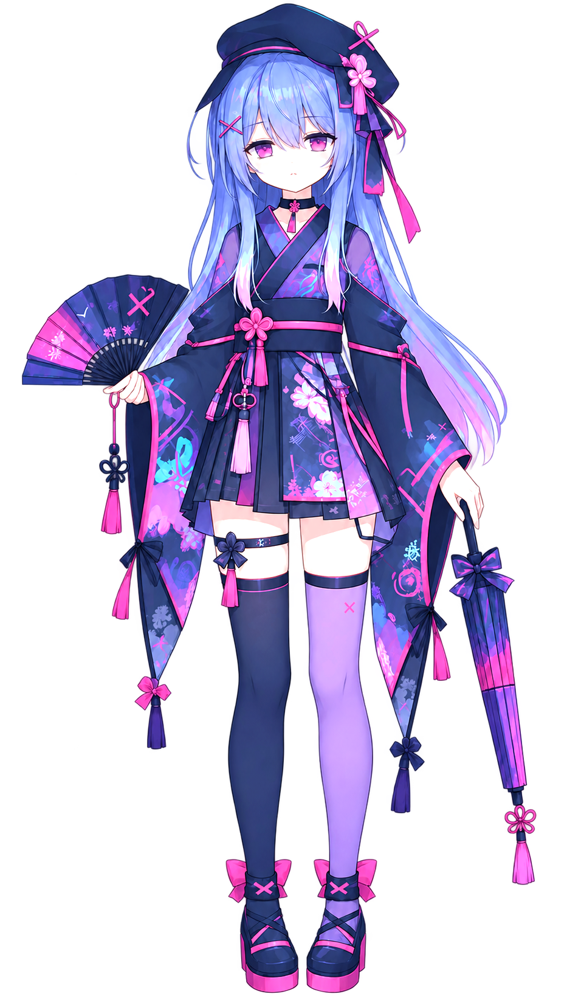

  

<table>
   <tr>
    <td colspan="2">

<h3 align="center">The UNIVERSE I'm IMAGINING &nbsp; \(⁠╹⁠▽⁠╹⁠⁠)/ </h3>

  </tr>

<td valign="top" width="62%">

I'm a **developer, AI systems research engineer, polymath, and an unapologetic STEM nerd**. I like understanding things from the model down to the machine, and I enjoy moving between different areas of computing and science. 

My main focus is **AI systems**, especially LLMs, world models, generative & diffusion models, multimodal learning, reasoning, agentic systems and GPU computing.

I'm also interested in **robotics, low-level systems, hardware-software co-design, neuroscience, AR/VR, graphics, animation, creative coding, artificial life, algorithms, competitive programming, and mathematics** ... honestly, the list is endless. I'm interested in almost everything, and sooner or later I usually want to learn it, build something with it, or both.

I experiment a lot. I build things, test ideas, go down rabbit holes, and sometimes end up somewhere completely different from where I started.
Mostly, I just love learning about things and making something with them.

On the right, you can meet **Yui**, my anime mascot. I created her as a visual representation of me and my work. Say "hi!" to her :)

</td>
<td align="center" valign="absmiddle">

</td>
</tr>
</table>

Thanks for stopping by

Feel free to look around, explore the projects, and wander through the things I've been building and experimenting with. You'll find a list of them further down, along with plenty of side quests hidden around here too.

## Contact

**In This Dream, I Am Here in Reality**

 ·  ·  ·  ·  ·  ·  ·  · 

**GitHub Quests**

 ·  ·  · 

**Sponsors**

Your sponsorship means a lot to me. It will help me sustain my projects actively, make more of my ideas come true, and push me to create more PRs on GitHub. If my code has been helpful to you, kindly consider .

## Widgets

  <picture>
    <source media="(prefers-color-scheme: dark)" srcset="https://github-stats-extended.vercel.app/api?username=polymorpherxx&custom_title=Nerdy%20Stats&show=reviews%2Cdiscussions_started%2Cdiscussions_answered%2Cprs_merged%2Cprs_merged_percentage%2Cprs_commented%2Cprs_reviewed%2Cissues_commented&show_icons=true&include_all_commits=true&disable_animations=true&bg_color=1b1c24&hide_border=true&title_color=E9A8CC&icon_color=C2428F&text_color=9198A1&ring_color=C2428F">
    <source media="(prefers-color-scheme: light)" srcset="https://github-stats-extended.vercel.app/api?username=polymorpherxx&custom_title=Nerdy%20Stats&show=reviews%2Cdiscussions_started%2Cdiscussions_answered%2Cprs_merged%2Cprs_merged_percentage%2Cprs_commented%2Cprs_reviewed%2Cissues_commented&show_icons=true&include_all_commits=true&disable_animations=true&bg_color=e8e9ed&hide_border=true&title_color=A52F72&icon_color=C2428F&text_color=656D76&ring_color=C2428F">
    
  </picture>
  <picture>
    <source media="(prefers-color-scheme: dark)" srcset="https://github-stats-extended.vercel.app/api/top-langs?username=polymorpherxx&layout=compact&langs_count=20&disable_animations=true&bg_color=1b1c24&hide_border=true&title_color=E9A8CC&text_color=9198A1">
    <source media="(prefers-color-scheme: light)" srcset="https://github-stats-extended.vercel.app/api/top-langs?username=polymorpherxx&layout=compact&langs_count=20&disable_animations=true&bg_color=e8e9ed&hide_border=true&title_color=A52F72&text_color=656D76">
    
  </picture>

<picture>
  <source media="(prefers-color-scheme: dark)" srcset="https://github-readme-activity-graph-polymorpherxx.vercel.app/graph?username=polymorpherxx&custom_title=Contribution%20Graph&bg_color=1b1c24&hide_border=true&area=true&radius=8&title_color=E9A8CC&color=9198A1&line=C2428F&point=F7D6EA&area_color=C2428F">
  <source media="(prefers-color-scheme: light)" srcset="https://github-readme-activity-graph-polymorpherxx.vercel.app/graph?username=polymorpherxx&custom_title=Contribution%20Graph&bg_color=e8e9ed&hide_border=true&area=true&radius=8&title_color=A52F72&color=656D76&line=C2428F&point=7A2154&area_color=E9A8CC">
  
</picture>

<picture>
  <source media="(prefers-color-scheme: dark)" srcset="https://raw.githubusercontent.com/polymorpherxx/polymorpherxx/output/github-contribution-grid-snake-dark.svg">
  <source media="(prefers-color-scheme: light)" srcset="https://raw.githubusercontent.com/polymorpherxx/polymorpherxx/output/github-contribution-grid-snake.svg">
  
</picture>

  <picture>
    <source media="(prefers-color-scheme: dark)" srcset="https://trophygithubreadmelang.cybee.dpdns.org/?username=polymorpherxx&theme=radical&no-frame=true&margin-w=8&margin-h=8&column=10&row=1">
    <source media="(prefers-color-scheme: light)" srcset="https://trophygithubreadmelang.cybee.dpdns.org/?username=polymorpherxx&theme=flat&no-frame=true&margin-w=8&margin-h=8&column=10&row=1">
    
  </picture>

## Visitors

  

